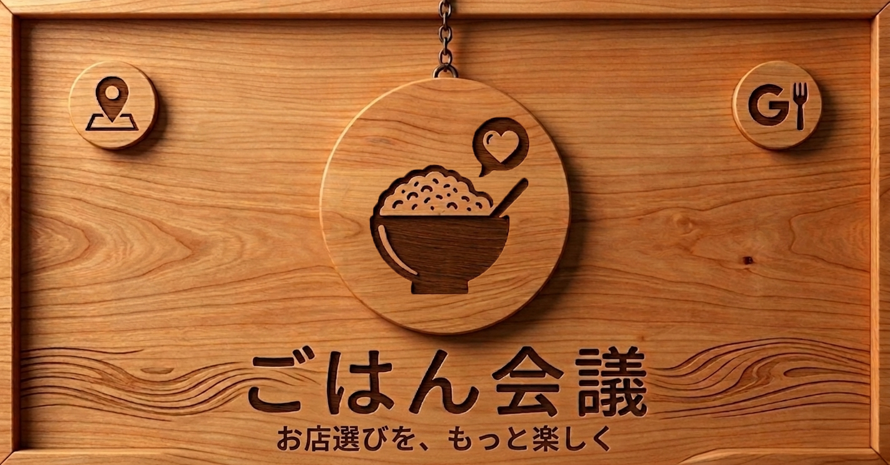

# ごはん会議

  

## サービス概要
ごはん会議は、複数人で「どこのお店に行くか」を決める過程と結果を記録として残せる、提案・投票型のお店選び共有アプリです。  
URL共有で参加者が候補店を登録し、いいねで意見や温度感を可視化できます。  
その場で決めて終わりではなく、「誰と・どんなお店を選んだか」をユーザーに紐づけて保存し、次回のお店選びに活かせる体験を提供します。

LINEなどのチャットでは、候補店のURLやスクリーンショットが流れやすく、あとから比較しづらい課題があります。  
また、複数人でのお店選びでは、誰がどの候補にどれくらい行きたいのかが見えにくく、苦手な食べ物や予算感などの条件も言い出しづらいことがあります。  
ごはん会議は、候補をひとつにまとめ、いいねで温度感を見える化し、希望条件も共有しながら無理なく決められる体験を目指しています。  
ログイン必須の設計により、参加したイベントや選んだお店を継続的に管理でき、お店ログとして次回のお店選びにも再利用できます。

## アプリURL
https://gohankaigi.com

#### お試しユーザーアカウント

| 項目 | 内容 |
| --- | --- |
| メールアドレス | `test@example.com` |
| パスワード | `password` |

## このサービスへの思い・作りたい理由
複数人で食事会を開くとき、候補店のURLやメモがチャット上で埋もれてしまい、比較や決定に時間がかかることが多くありました。  
特に幹事側は、候補の整理、意見の回収、最終決定までの調整負担が大きくなりがちです。  
こうした経験から、イベント単位で候補店と意見をまとめ、決定までを進められる「ごはん会議」を開発しました。

また、幹事だけでなく参加する側にも、お店選びの中で気を使う場面があります。  
「予算はこれくらいがいい」「この食べ物は苦手」といった条件は、相手との関係性によっては言い出しづらく、本音を出せないまま話が進んでしまうこともあります。  
ごはん会議では、そうした言いづらい意見も共有しやすくし、参加者にとっても無理のないお店選びを支えたいと考えています。

さらに、お店ログとして体験を蓄積し、次回のお店選びに再利用できることも大切にしています。  
その場の調整だけで終わらず、次に行きたいお店や良かったお店を残しながら、自分なりのお店選びの軸を育てていけるサービスを目指しています。

## ユーザー層について
- メインターゲット  
友人・同僚・家族との食事会で、お店決めの調整役になりやすい人

- サブターゲット  
食べることが好きで、カフェ巡りやランチを楽しみながら、気になるお店を自分用にストックしておきたい人  
親友や恋人など、特定の相手と次に行きたいお店を整理・管理しておきたい人

- 背景  
チャット中心の調整では情報が分散しやすく、候補比較や合意形成が長引きやすい。  
また、苦手な食べ物や予算感など、参加者側の条件は相手に気を使って言い出しにくいこともある。  
過去の店選びを振り返りにくいため、毎回ゼロから検討が発生しやすい。

## サービス利用のイメージ
1. ユーザーがイベントを作成し、日時・場所・メモを登録する  
2. 発行された共有URLを参加者に送る  
3. 参加者がイベントに参加し、候補店を登録する  
4. いいね・並び替え・ランキング表示で候補を比較する  
5. 参加者の希望条件（苦手なもの・予算・補足）も参考にしながら決定する  
6. イベント内で登録したお店は、自分のお店ログに自動で蓄積される  
7. お店ログでは、自分用メモ（行った感想・気になる点）を残し、カテゴリ付与や並び替え、絞り込みを通じて次回のお店選びに再利用できる

## 機能一覧

| 画面 | 内容 |
| --- | --- |
| トップ | サービス概要、ログイン/新規登録への導線 |
| ログイン | メール/パスワード、LINEログイン対応 |
| 新規登録 | アカウント作成 |
| パスワード再設定 | 本リリース時点では一時停止中（今後再公開予定） |
| ダッシュボード | イベント作成、イベント一覧、お店ログへの導線 |
| イベント一覧 | 作成したイベントの一覧表示 |
| イベント作成 | タイトル、日付、時間、場所、メモを登録 |
| イベント詳細 | 参加者、共有URL、候補店、ランキング、希望条件、候補店ごとの地図表示を行う |
| イベント編集 | イベント内容の更新 |
| イベント参加ページ | 共有URL経由で参加し、投稿・いいねが可能 |
| お店登録 | 候補店（店名/URL/メモ）を登録 |
| お店編集 | 候補店情報の更新・削除 |
| お店ログ一覧 | 登録店の検索、カテゴリ絞り込み、並び替え |
| お店ログ編集 | ログカテゴリ・ログメモの更新 |
| Google Map連携 | 候補店の地図表示、Google Mapで開く導線を提供 |
| 利用規約 | 静的ページ |
| プライバシーポリシー | 静的ページ |

## 使用技術

| 項目 | 技術 |
| --- | --- |
| バックエンド | Ruby 3.3.10 / Ruby on Rails 7.1.6 |
| フロントエンド | Tailwind CSS / daisyUI / Hotwire（Turbo, Stimulus） |
| データベース | PostgreSQL（Neon） |
| 認証 | Devise / OmniAuth（LINE） |
| API | Google Places API（候補店情報取得） / Google Maps Embed（地図表示） |
| i18n | rails-i18n / devise-i18n |
| テスト | RSpec / SimpleCov |
| CI | GitHub Actions |
| 開発環境 | Docker |
| 本番環境 | Render |
| その他 | RuboCop |

## 使用技術の選定理由
- **Ruby on Rails**  
  認証、CRUD、ルーティングなどの基本機能を効率的に実装しやすく、個人開発でも開発速度を出しやすいため採用しました。

- **Hotwire（Turbo / Stimulus）**  
  JavaScript を増やしすぎずに、いいねのその場更新や入力補助などの体験改善を行いやすく、Rails 標準の仕組みを活かせるため採用しました。

- **Tailwind CSS / daisyUI**  
  画面ごとの余白や情報整理を細かく調整しながら、サービス全体の世界観を揃えやすいため採用しました。

- **PostgreSQL（Neon）**  
  Rails との相性が良く、本番環境でも扱いやすいことに加え、Render と分離してデータベースを管理できるため採用しました。

- **RSpec / GitHub Actions / SimpleCov**  
  主要導線のリグレッション防止、CI による継続的な確認、カバレッジの可視化を通じて、個人開発でも品質を保ちやすくするため採用しました。

## 技術的に工夫した点
- 候補店一覧やお店ログ一覧では、ソートや検索条件を操作後も保持し、繰り返し比較しやすいようにしました。
- いいね機能は Hotwire を用いてその場更新に対応し、画面遷移を減らしながら件数やボタン状態が変わるようにしました。
- 候補店登録では、URL から店名候補を自動取得する入力補助を実装し、手入力の負担を減らしながら候補登録のしやすさを高めました。
- お店ログでは、オートコンプリート機能を追加し、過去に登録した店名を検索しやすくすることで入力時の負担を減らしました。
- 候補店一覧では Google Map の埋め込み表示と外部マップ導線を組み合わせ、店名やメモだけでなく位置情報も含めて比較しやすいようにしました。
- 画面表示やメッセージの文言は i18n を用いて整理し、保守しやすい構成にしました。
- request spec / system spec を使って主要導線を確認し、GitHub Actions で継続的にテストできるようにしました。

## 差別化ポイント

#### 競合サービス分析
一般的なグルメサービスは「お店検索」には強い一方、複数人での意思決定プロセス（候補の集約・比較・合意形成）をイベント単位で管理する設計は弱い傾向があります。

#### 当サービスの差別化ポイント
- イベント単位で、候補店・参加者・希望条件を一元管理できる  
- いいねにより、候補の人気だけでなく「みんなの行きたい度」を把握しやすい  
- 匿名で希望条件を共有できるため、苦手な食べ物や予算感などの言いづらい意見も拾いやすい  
- 幹事の整理負担だけでなく、参加者の発言しづらさにも寄り添っている  
- ログイン必須設計により、参加履歴や選択履歴をユーザー単位で蓄積できる  
- お店ログに、イベント内で自分が登録したお店（行った店・気になって登録した店）を蓄積し、メモやカテゴリ整理を通じて次回の意思決定に再利用できる  
- 複数人でのお店選びを主軸にしながら、自分用の候補管理や、特定の相手と次に行きたいお店のストックにもつなげられる

## 今後の実装予定
今後は、より使いやすく継続利用しやすいサービスにするため、以下のような機能追加・改善を検討しています。

- Googleログインの追加や LINE 通知機能の実装を通じて、参加や再訪のハードルを下げる
- お店 OGP をユーザー自身でも設定できるようにし、候補店登録時の見栄えや共有体験を高める
- お店ログに蓄積した情報をコピーして、新しいイベントのお店候補へ再利用しやすくする
- 現在のいいね機能を、より温度感を表現しやすい星評価へ発展させる
- プロフィール欄を強化し、好き嫌いや好みの傾向も含めて共有できるようにする
- 「誰と行ったお店か」を振り返れるようにし、人 × 店の組み合わせで記録を見返せるようにする
- イベントを進行中・終了済みなどの状態で分けて管理し、ダッシュボードから把握しやすくする
- イベントごとにカバー画像を設定できるようにし、一覧画面でもイベントの雰囲気が伝わるようにする
- モバイル表示の使いやすさをさらに改善し、スマートフォンでも快適に操作できる体験を目指す

### 画面遷移図
※ 画面遷移図は作成時点のもののため、現在の実装と一部差分があります。今後更新予定です。

[Figmaで画面遷移図を表示](https://www.figma.com/design/oiS8Qecin0WFz8C2ZREPSM/%E5%8D%92%E5%88%B6%E3%80%80%E7%94%BB%E9%9D%A2%E9%81%B7%E7%A7%BB%E5%9B%B3?node-id=0-1&p=f&t=dM6pWllWVzZC9kJk-0)

### ER図

